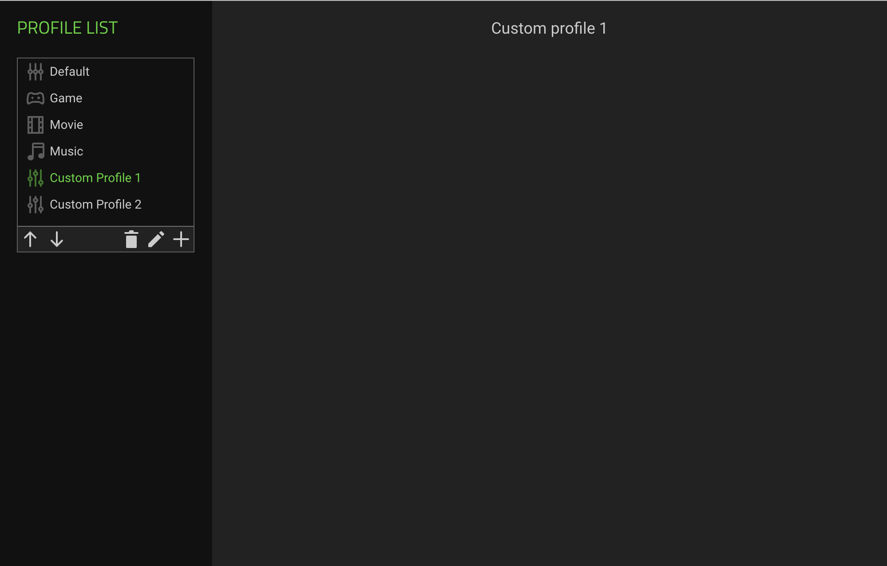

# Profile Manager

This repository contains the codebase for managing user profiles in a web application. The Profile Manager offers a streamlined interface for users to interact with their profiles, featuring profile selection, manipulation, and persistence functionalities.

## Features

- **Profile Selection and Display**: Easily select profiles from a list displayed in the left panel, with detailed information about the selected profile shown in the right panel.

- **Profile Manipulation**: Move profiles up or down in the list using intuitive icons. Add custom profiles with the click of a button, automatically appended to the end of the list and selected.

- **Default Profiles**: Four default profiles ("Default", "Game", "Movie", and "Music") are provided, each with its own icon. Default profiles cannot be renamed or deleted, ensuring data integrity.

- **Profile Deletion Handling**: When a profile is deleted, the profile above it in the list is automatically selected, maintaining user flow.

- **Profile Renaming**: Rename profiles with validation to prevent empty names, offering flexibility while maintaining data integrity.

- **Local Storage Integration**: User changes are saved in the LocalStorage for persistent storage across sessions. If LocalStorage is empty, it is populated with the four default profiles, with "Default" selected by default.

## Bonus Feature

- **Auto-Save Mechanism with Simulated API**: An auto-save mechanism ensures changes are automatically saved after a 3-second idle period. Simulated API calls synchronize profile data, providing seamless data persistence and synchronization.

## Installation and Usage

To install the dependencies, run the following command:

```
npm install
```

To start the server, run the following command:

```
npm start
```

The server will be accessible at http://localhost:3000.


